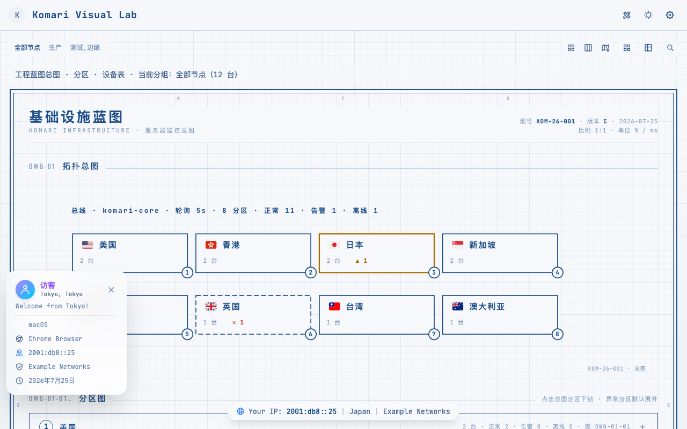

<div align="center">

# 📐 blueprint

## 给 Komari Monitor 的一套「工程蓝图 · 运维图纸」主题

把节点监控渲染成工程图纸式的拓扑总图、分区图与设备表。


**[📥 下载 Release](https://github.com/jacob-bytes/komari-theme-blueprint/releases)** ·
**[🚀 安装](#-安装--升级)** ·
**[🔧 开发](#️-本地开发)**

</div>

---

## 📸 预览

<div align="center">



</div>

---

## 🚀 项目定位

| 项目     | 说明                                                                    |
| :------- | :---------------------------------------------------------------------- |
| 当前版本 | **v0.1.1**                                                              |
| 主题定位 | Komari Monitor 可导入 zip 主题，不是普通 Web App 部署包                 |
| 视觉风格 | 工程图纸（白图 / 晒图蓝）、等宽字体、浅色 / 深色 / 北京时间自动日夜模式 |
| 数据能力 | Metric Store 优先，旧接口自动 fallback，兼容 Komari 1.2.x               |
| 发布产物 | `blueprint-build-<short-sha>.zip`                                       |

> 好看只是外壳。blueprint 的重点，是把 Metric、Ping、流量、费用和运维工具整合成一张真的会打开来看的监控图纸。

---

## 🗺️ 蓝图视图

蓝图视图是主题的核心，把节点监控渲染为整套工程图纸：

| 区块     | 说明                                                               |
| :------- | :----------------------------------------------------------------- |
| 拓扑总图 | 分区符号（国旗 + 地域名 + 台数 + 告警 / 离线）、干线、详图索引气泡 |
| 分区图   | 分区手风琴 + 分组边界框（2 列设备卡片，仅显示主机名）              |
| 设备表   | 按组分节，CPU / 内存 / 硬盘 / 网络 / 延迟，状态印章                |
| 图签     | 图纸标题栏、张次、修订记录、审核章                                 |

- 白图（浅色）与晒图蓝（深色）双纸模式跟随主题
- 点击分区图设备符号可定位到设备表对应行并高亮
- 地域（国旗 + 中文名）由 `regionHelper` 自动映射，新增地域无需改代码

---

## 🌍 首页驾驶舱

- 概览卡片（内存、硬盘、剩余价值、累计流量、实时上下行等）+ 点阵旋转地球（cobe）
- 卡片 / 列表双视图，密集节点列表自动虚拟化
- `mini` / `compact` / `comfortable` / `large` 四档卡片密度，默认保持 `compact`
- 收藏、总流量、峰值、离线、高负载、即将到期等快捷控制
- 节点 `message` 在卡片 / 列表以纯文本提示，不使用 `v-html`

---

## 🧰 首页工具

工具条默认折叠，点击右上角「显示首页工具」展开。

| 工具     | 用途                                               |
| :------- | :------------------------------------------------- |
| 节点     | 节点卡片 / 列表视图（默认）                        |
| 蓝图     | 工程蓝图总图 · 分区 · 设备表                       |
| 对比     | 最多四台节点实时横向对比                           |
| 性价比   | 比较每核、每 GB 内存、流量额度和周期成本           |
| 快照导出 | 导出 JSON / CSV，内置 CSV 公式注入防护             |
| 审计日志 | 管理员 / 访客记录、结构化安全信息、JSON / CSV 导出 |

> 工具按公开度区分：节点、对比、蓝图无需登录；性价比、快照导出、审计日志仅登录后显示与执行。

---

## ✨ 节点详情页

| 优化方向 | 当前能力                               |
| :------- | :------------------------------------- |
| 概览卡   | 18 类指标，7 套预设                    |
| 图表面板 | 12 个图表族，9 套预设                  |
| 响应式   | 移动端 2 列、中屏 3 列、宽屏 4 列      |
| 分区模式 | 可选概览 / 负载 / 延迟标签页           |
| 兼容配置 | 保留旧图表 key、旧卡位和 JSON 模板解析 |

涵盖 CPU、Load、内存、Swap、磁盘、GPU、网络（实时 / 累计流量 / TCP / UDP）、Ping（延迟 / 丢包 / 多任务统计）、温度等指标。

---

## 📈 Metric 接口升级

新版接口优先，旧版 Komari 后端继续保持兼容。

```text
新版 Metric API 有效
        ↓
public:queryMetrics / public:getPingMetricStats
        ↓
无数据或接口不可用
        ↓
common:getRecords / legacy records fallback
        ↓
保持图表与 Ping 正常展示
```

| 项目                        | 状态                |
| :-------------------------- | :------------------ |
| `public:queryMetrics`       | ✅ 优先使用         |
| `public:getPingMetricStats` | ✅ 优先使用         |
| `common:getRecords`         | ✅ 自动 fallback    |
| 自定义 `start` / `end`      | ✅                  |
| Metric `null` 断点          | ✅ 保留，不误判丢包 |
| 旧接口负值丢包哨兵          | ✅ 兼容             |

---

## 📶 Ping 模块增强

| 优化项目                 | 状态 |
| :----------------------- | :--- |
| Min / Max / Avg / Latest | ✅   |
| P50 / P99 / 波动率       | ✅   |
| 多任务丢包统计           | ✅   |
| 100% 丢包任务保留        | ✅   |
| Null 点不再误判丢包      | ✅   |
| 自定义起止时间           | ✅   |
| 新旧接口自动切换         | ✅   |
| 快速切换请求防旧数据覆盖 | ✅   |

---

## 🧱 底层架构

新功能遵循统一调用链：

```text
Component
    ↓
Composable
    ↓
Service
    ↓
RequestManager / CacheService
    ↓
API / RPC
```

同步具备：

- [x] 请求去重与并发限制
- [x] 超时、重试和 Abort 清理
- [x] TTL / LRU-like / 引用计数缓存
- [x] Metric Store 优先与旧接口 fallback
- [x] 共享 Ping / 负载历史数据流
- [x] 登录权限与敏感操作校验
- [x] Vue 响应式节点索引和实时更新

---

## 🔒 公开访问与安全边界

首页和节点详情页始终保持公开，不使用全局路由守卫阻断普通监控。

| 公开能力               | 登录后能力                   |
| :--------------------- | :--------------------------- |
| 普通节点状态与实时指标 | Hidden 节点                  |
| Load / Ping 历史图表   | 拓扑、性价比、健康摘要       |
| Ping 延迟与丢包统计    | 快照导出与审计日志           |
| 公开厂商元数据         | Geo 增强、磁盘预测等敏感路径 |

安全细节包括：

- 快照导出需要登录验证，可选二级密码
- CSV 中和 `=`、`+`、`-`、`@`、`|` 等公式注入前缀
- Markdown 链接和图片限制 URL scheme，拦截 `javascript:`
- 未登录可隐藏价格、费用卡片和后台入口
- 登录过期时降级到公共展示，不让整个 dashboard 崩溃

---

## 📱 WebKit / iOS 兼容

| 环境                       | 策略                                   |
| :------------------------- | :------------------------------------- |
| Safari 15.4+               | 构建语法目标与基础可用边界             |
| Safari 16.4+               | Tailwind CSS v4 完整视觉基线           |
| 缺少 `oklch` / `color-mix` | 使用 sRGB token 和可读降级样式         |
| 旧 WebKit                  | 使用 sRGB token 与可读降级样式         |
| Firefox                    | 关闭高成本视觉效果，保证列表与图纸流畅 |

---

## ⚙️ 主题设置

全部设置由 [`komari-theme.json`](komari-theme.json) 托管到 Komari 后台，无需修改代码。

| 分类           | 代表设置                                            |
| :------------- | :-------------------------------------------------- |
| 基础与外观     | 主题模式、更新间隔、RPC 模式、默认视图、卡片尺寸    |
| 首页布局       | 公告、访客信息、色觉辅助配色                        |
| 高级工具与隐私 | 工具总开关、隐藏后台 / 价格、厂商别名、导出二级密码 |
| 快捷控制与列表 | 快捷按钮、列表元数据、离线置底、预警阈值            |
| 详情概览       | 18 类指标卡、7 套方案、分区标签页                   |
| 详情图表       | 12 个图表族、9 套方案、GPU 图表和自定义 keys        |
| 自定义背景     | 亮 / 暗 URL、图片 / 视频、模糊和遮罩                |

---

## 📦 安装 / 升级

### 方式一：使用 GitHub 仓库地址

Komari 后台支持直接填写仓库地址并拉取最新 Release：

```text
https://github.com/jacob-bytes/komari-theme-blueprint
```

### 方式二：手动安装 Release

1. 打开 [Releases](https://github.com/jacob-bytes/komari-theme-blueprint/releases)
2. 下载最新的 `blueprint-build-*.zip`
3. 登录 Komari Monitor 后台，进入 **设置 → 主题管理**
4. 上传 zip 并启用主题
5. 在主题设置中调整视觉、卡片、快捷控制和工具

> 请上传 Release 附件中的主题 zip，不要上传 GitHub 自动生成的源码压缩包。

---

## 🛠️ 本地开发

环境要求：Node.js `^20.19.0` 或 `>=22.12.0`，Bun `>=1.2.0`。

```bash
bun install
bun run dev
bun run lint
bun run build
bun run test:visual
bun run preview
```

更新确认过的视觉基准图：

```bash
bun run test:visual:update
```

视觉测试需要先执行 `bunx playwright install chromium`。截图差异会输出到 `test-results/` 和 `playwright-report/`。

构建成功后会生成：

- `dist/`
- `blueprint-build-<short-sha>.zip`

发布包固定包含：

```text
komari-theme.json
preview.png
dist/
```

> 发布版本只改 [`komari-theme.json`](komari-theme.json) 顶层 `version`，不要给 `package.json` 添加顶层 `version`。

---

## 📝 更新日志

<details open>
<summary><strong>v0.0.11 · 首个完整可用版本</strong></summary>

- 主题整体改造为 blueprint 工程蓝图风格：纸样设计令牌、白图 / 晒图蓝、等宽字体
- 蓝图视图：拓扑总图（国旗 + 地域 + 台数）、分区图（主机名卡）、设备表、图签修订
- 首页恢复概览卡片 + 点阵旋转地球（cobe）；工具精简为节点 / 蓝图 / 对比 / 性价比 / 导出 / 日志
- 全站卡片统一卡片化背景；修复设备表百分比、SVG 黑色填充与文本拉伸、告警判断、Ping 跳转闪烁等已知问题
- 版本源 `komari-theme.json`，zip 命名 `blueprint-build-<short-sha>.zip`

</details>

---

## ⭐ Support

如果这个项目帮助到了你，欢迎：

- ⭐ Star 本项目
- 🍴 Fork 并贡献代码
- 💬 提交 Issue 或 Feature Request
- 📢 分享给更多 Komari 用户

你的每一个 Star，都是继续维护更新的动力。

---

## ☕ Donation / Sponsor

如果你喜欢这个项目，也欢迎支持后续开发。每一份支持都会用于功能开发、Bug 修复、性能优化、文档和长期维护。

感谢 **可乐杯里泡枸杞**、**Leo Lin**、**HelloWorldx** 、**johnmill**的捐赠支持。

---

## 🙏 致谢

感谢原始主题作者 **Tokinx**，感谢 [Komari](https://github.com/komari-monitor/komari)、[Komari Naive](https://github.com/tonyliuzj/komari-naive)、Vue、Vite、reka-ui、Tailwind CSS，以及所有反馈 Issue、提交 PR 和分享建议的朋友。

本主题（blueprint）延续自 [komari-theme-Glassmorphism](https://github.com/sanrokamlan-prog/komari-theme-Glassmorphism)——感谢该主题及其社区的架构、功能与维护经验，为 blueprint 的蓝图化改造提供了坚实基础。

## 📄 License

[MIT](LICENSE)
